## Ideas

I want to discretize the orbit in time and space.
I want to use a fictitious time element so that I can calculate faster orbits with higher resolution.
I want to do a guidance system.

### How to accomplish this:

1) ~~Learn the **LEVI-CIVITA** Regularization~~
2) Learn the Kustaanheimo-Stiefel Regularization

### What I've done so far:

1) Learned methods of describing orbital motion
    1) MEE
    2) ECI
    3) ICRF
2) Learned a lot of control theory
    1) Optimal Control
        1) PMP
        2) HJB
        3) Bang-Bang
        4) Direct Collocation
        5) Shooting Methods (direct/indirect)
        6) DP/Programming methods
    2) Controllers
        1) PID
        2) LQR
        3) MPC
        4) Sliding Mode
    3) Transfer Functions and control system design
3) Ion Engine mechanics

### What I need to improve:

1) Ion Engine Dynamics knowledge
2) Delta-V on Asteroid clarification
3) Simulation is lack-luster
4) Control System Design knowledge is vague
    1) What are transfer functions
    2) Need intimate knowledge of filters, estimation, prediction dynamics
    3) Need a good system true dynamics
    4)

### Steps to finish:

1) Design a guidance system
2) Retrieve an engine for the guidance requirements
3) Build structure around inertial requirements
4) Design a harness
5) Design a power system and regulator for the harness
6) Derive exact cost estimates
7) Iterate

### System Design

```mermaid
%% Top-Down Graph
graph LR
%% Subgraphs and Nodes
    subgraph Sensors[Sensor Suite]
        direction LR
        class Sensors sensorStyle;
        subgraph PropulsiveSensors[Propulsion]
            direction TB
            Fuel[Fuel Gauge];
            Pressure[Engine Pressure];
            Power[Power Sensor];
            class PropulsiveSensors propulsionStyle;
        end

        subgraph MeasurementSensors[Orientation]
            direction TB
            Inertial[Inertial Sensors];
            PositionStar[Star Tracker];
            PositionSun[Sun Tracker];
            class MeasurementSensors orientationStyle;
        end
    end
    class Sensors sensorStyle;
    PropulsiveSensors --> UKF[State Estimator];
    MeasurementSensors --> UKF[State Estimator];
    subgraph Controls[Control System]
        direction LR
        Trajectory[Trajectory Optimizer];
        Dynamics[True Dynamics];
        class Controls controlStyle;
    end
    class Controls controlStyle;
    subgraph Actuators
        direction LR
        class Actuators actuatorStyle;
        subgraph Attitude[Attitude Controller]
            Wheel[Reaction Wheels];
            class Attitude attitudeStyle;
        end
        subgraph Propulsion
            direction LR
            EP[Ion Engine];
            Hall[Hall Thrusters];
            class Propulsion propulsionStyle;
        end
    end
    class Actuators actuatorStyle;
    subgraph Energy
        direction TB
        Solar[Solar Panels];
        Battery;
        Backup[Redundancies, Emergencies, Transients];
        class Energy energyStyle;
    end
    class Energy energyStyle;
    subgraph PDU[Power Distribution Unit]
        direction LR
        Regulator;
        Fault[Fault Detector];
        Power[Efficiency Estimation];
        class PDU pduStyle;
    end
    class PDU pduStyle;
    Energy --> PDU[Power Distribution Unit];
    class Energy energyStyle;

%% PDU Communication
    PDU -->|Power Analytics| Controls;
    Controls -->|Power Demand and Redistribution| PDU;
    PDU --> Sensors;
    PDU --> Actuators;

%% Controls
    UKF --> Controls;
    Telemetry --> Controls;
    Controls -->|Mission Analytics| Telemetry;
    Controls --> Actuators;

%% Class Definitions for Styling
    classDef sensorStyle fill: #C8E6C9, stroke: #388E3C, stroke-width: 2px;
%% Green tones for sensors
    classDef propulsionStyle fill: #FFE0B2, stroke: #F57C00, stroke-width: 2px;
%% Orange tones for propulsion
    classDef orientationStyle fill: #B3E5FC, stroke: #0288D1, stroke-width: 2px;
%% Blue tones for orientation sensors
    classDef controlStyle fill: #BBDEFB, stroke: #1976D2, stroke-width: 2px;
%% Light blue tones for controls
    classDef actuatorStyle fill: #FFCDD2, stroke: #D32F2F, stroke-width: 2px;
%% Red tones for actuators
    classDef attitudeStyle fill: #F8BBD0, stroke: #C2185B, stroke-width: 2px;
%% Pink tones for attitude control
    classDef energyStyle fill: #FFF9C4, stroke: #FBC02D, stroke-width: 2px;
%% Yellow tones for energy systems
    classDef pduStyle fill: #D7CCC8, stroke: #5D4037, stroke-width: 2px;
%% Brown tones for PDU reliability
    classDef commentStyle fill: #ECEFF1, stroke: #607D8B, font-style: italic, stroke-width: 2px;
%% Gray tones for comments
```

Regularization: https://www.eolss.net/sample-chapters/c01/E6-119-55-09.pdf

KS: https://pure.tue.nl/ws/portalfiles/portal/128511178/BEP_KS_Regularization.pdf_Camp_op_den_L.pdf

END GOAL: https://rexlab.ri.cmu.edu/papers/ks_low_thrust.pdf

**Quaternion representation of the metric tensor?**

### 12/9/2024:
- KS regularization helps for numerical simulations of orbits of point masses

Problem: I need to know how the orbits look under low thrust if I'm to break out of orbit and reach the asteroid.

What's the optimal way to change the orbits? 

1) Find the optimal trajectory for a point mass applying restrictions for 3d objects
2) Give data to Actuators to solve for torques and thrust needed.
3) Let the rest of the system compute the power needed
4) Loosely coupled system.

